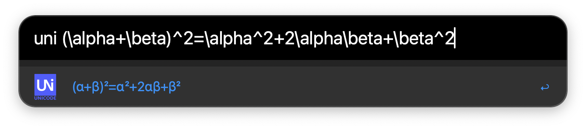

# Unicodeit with Alfred

	

<b><i>
	Type Unicode with LaTeX!
</i></b>

## Abstract

Inspired by [unicodeit](https://github.com/svenkreiss/unicodeit), but in Alfred! Starting with `uni`, then you can type $\LaTeX$ code and change it to Unicode easily. To download the workflow, see the [release page](https://github.com/sleepymalc/unicode/releases).

## Setup

It's easy to set up the workflow if you have `python3` installed on your laptop. Then, just follow the following steps:

1. Go to [unicodeit](https://github.com/svenkreiss/unicodeit) and see how to install it on your laptop. Basically, it's just `pip install unicodeit`.
2. Install this workflow on the [release](https://github.com/sleepymalc/unicode/releases) page, and install it to your Alfred.

That's it!

## Demo

	

